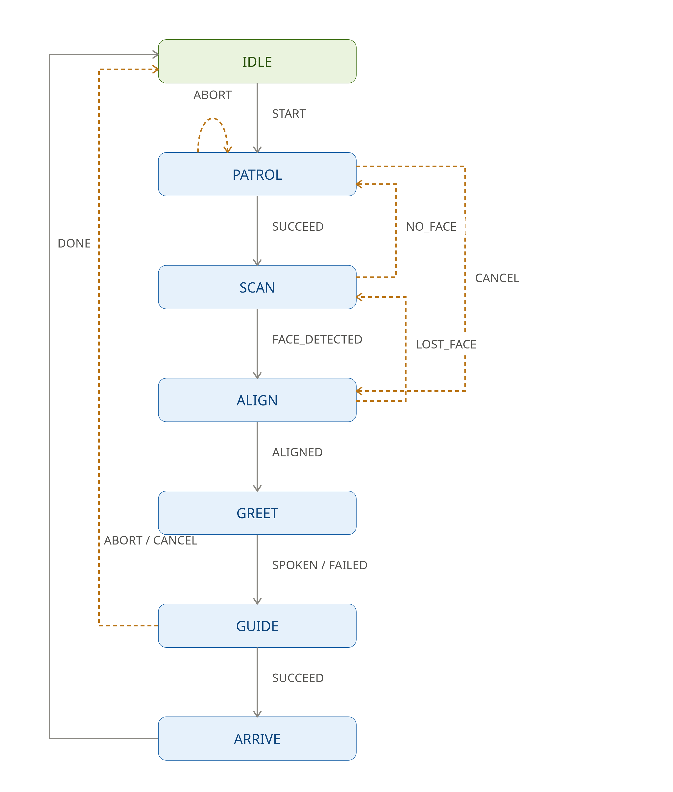

# ROS 2 Autonomous Guide Dog

This repository contains the ROS 2 (Jazzy) autonomous state machine and perception stack for a quadruped guide dog. The system integrates a Flat Finite State Machine (YASMIN), Nav2, YOLOv8-based person tracking, and custom Text-to-Speech (TTS) interaction to navigate and guide users safely.

## **Simulation Demo**

<video src="assets/simulation_behavior.mp4" width="100%" controls autoplay loop></video>

_Gazebo simulation showcasing Nav2 obstacle avoidance and YOLOv8 person alignment._

## **Flat FSM Architecture**

_Visual representation of the YASMIN flat FSM (`IDLE`, `PATROL`, `SCAN`, `ALIGN`, `GUIDE`)._

## **Branching Strategy**

To maintain a clean deployment pipeline between the physical hardware and the Gazebo simulation environment, this repository utilizes two distinct branches:

- **[`hardware` branch](https://github.com/your-username/your-repo-name/tree/hardware):** Contains strictly the custom high-level autonomous behaviors and communication interfaces (the `guide_dog_*` packages).
- **[`simulation` branch](https://github.com/your-username/your-repo-name/tree/simulation):** Contains the custom logic plus the quadruped kinematics (CHAMP) and Unitree Go2 models.

## **The Custom Guide Dog Stack**

These packages represent the core autonomous brain of the robot and are deployed to both simulation and physical hardware.

- **`guide_dog_mission`:** The C++ flat FSM built with YASMIN. It manages the custom states (`IDLE`, `PATROL`, `SCAN`, `ALIGN`, `GUIDE`), safely handling asynchronous ROS 2 executor callbacks and rapid Nav2 action client cancellations without race conditions.
- **`guide_dog_perception`:** A Python-based vision node utilizing YOLOv8 and `cv_bridge` to calculate normalized offset coordinates and depth for the `ALIGN` state's dual P-Controller.
- **`guide_dog_audio`:** A lightweight Python node exposing a ROS 2 `/speak` service for natural language mission announcements.
- **`guide_dog_interfaces`:** Custom ROS 2 definitions, notably `DetectedFace.msg` (handling X/Y offsets and Z-depth) and `Speak.srv`.

## **The Quadruped Simulation Stack**

These packages are utilized exclusively in the simulation branch to provide the physical robot model and locomotion kinematics.

- **`champ`, `champ_base`, `champ_msgs`:** The open-source CHAMP quadruped controller stack, responsible for converting standard `/cmd_vel` twists into complex joint trajectories.
- **`unitree_go2_description`:** The URDF and visual meshes for the Unitree Go2 robot.
- **`unitree_go2_sim` & `unitree_go2_slam`:** Launch files and configurations for the Gazebo simulation environment and SLAM mapping pipelines.
