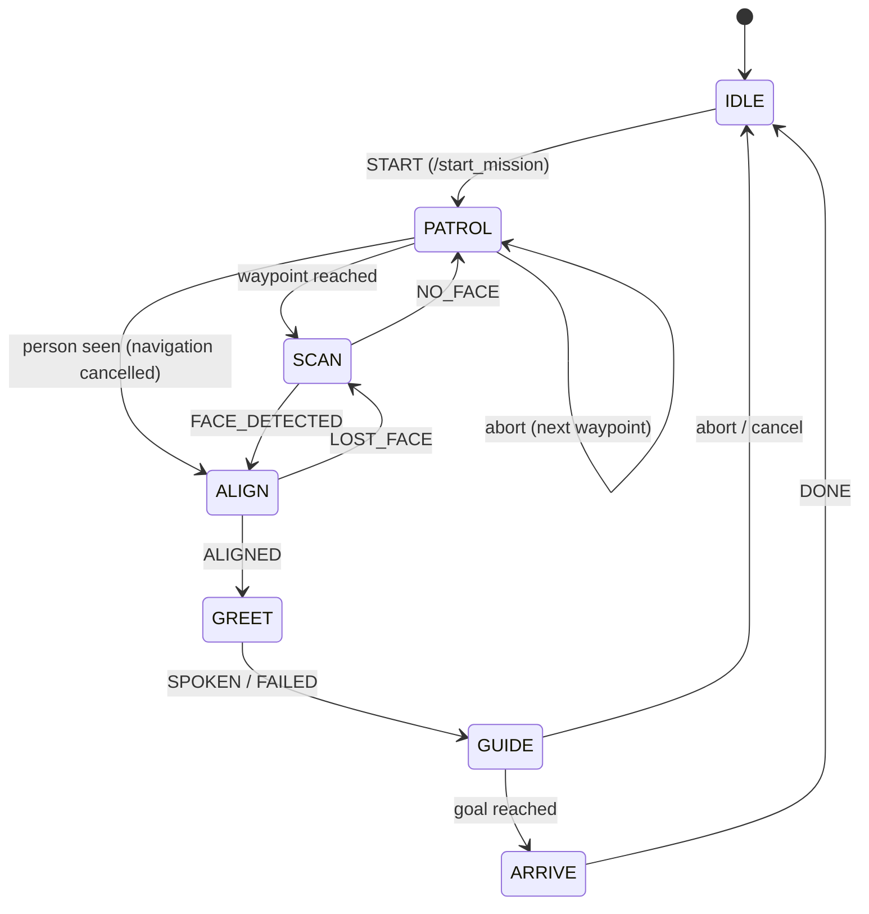

# Guide Dog Go2

A guide-dog application for the Unitree Go2, built on ROS 2 Foxy. The robot patrols a mapped floor and looks for a person with a RealSense camera and YOLOv8. When it finds one, it turns to face them, greets them through its own speaker and walks them to a fixed destination using Nav2.

Everything runs on the Go2's onboard Jetson (aarch64, Ubuntu 20.04, ROS 2 Foxy).

## Contents

- [How it works](#how-it-works)
- [Repository layout](#repository-layout)
- [Setup](#setup)
- [Running](#running)
- [Building a new map](#building-a-new-map)
- [Configuration](#configuration)
- [Troubleshooting](#troubleshooting)
- [Known limitations](#known-limitations)

## How it works

### Mission state machine

`guide_dog_mission` is a [YASMIN](https://github.com/uleroboticsgroup/yasmin) state machine (C++):


```mermaid
stateDiagram-v2
    [*] --> IDLE
    IDLE --> PATROL: START (/start_mission)
    PATROL --> SCAN: waypoint reached
    PATROL --> PATROL: abort (next waypoint)
    PATROL --> ALIGN: person seen (navigation cancelled)
    SCAN --> ALIGN: FACE_DETECTED
    SCAN --> PATROL: NO_FACE
    ALIGN --> GREET: ALIGNED
    ALIGN --> SCAN: LOST_FACE
    GREET --> GUIDE: SPOKEN / FAILED
    GUIDE --> ARRIVE: goal reached
    GUIDE --> IDLE: abort / cancel
    ARRIVE --> IDLE: DONE
```

| State | What it does |
|---|---|
| IDLE | Waits for `/start_mission` |
| PATROL | Sends the next patrol waypoint to Nav2; cancels navigation after 3 person detections in a row |
| SCAN | Turns in place 360° (IMU yaw from `/sportmodestate`) looking for a person with confidence > 0.75 |
| ALIGN | Turns to face the person. Each detection becomes a target heading in the IMU yaw frame, and a 50 Hz controller turns to it (see [Perception](#perception)). Coming from PATROL, it first waits for the robot to stop walking. |
| GREET | Speaks a greeting through `/speak` |
| GUIDE | Navigates to the fixed destination |
| ARRIVE | Announces arrival |

The FSM state is shown live in the YASMIN viewer web UI.

### Data flow

```
RealSense ──image──> perception_node (YOLOv8n, ONNX Runtime) ──/detected_face──> main_fsm
Hesai XT16 ──/lidar_points──> scan slices ──/scan, /scan_loc──> AMCL + Nav2
main_fsm ──/navigate_to_pose──> Nav2 ──/cmd_vel──> cmd_vel_bridge ──sport API Move──> Go2
main_fsm ──/speak, /announce──> tts_node ──audio hub API──> Go2 speaker
```

| Interface | Type | Producer → consumer |
|---|---|---|
| `/camera/camera/color/image_raw` | `sensor_msgs/Image` | RealSense → perception |
| `/detected_face` | `guide_dog_interfaces/DetectedFace` | perception → PATROL, SCAN, ALIGN |
| `/speak` | `guide_dog_interfaces/srv/Speak` | GREET, ARRIVE → `tts_node` (returns once the phrase has played) |
| `/announce` | `std_msgs/String` | status lines from IDLE, PATROL, SCAN, ALIGN, GUIDE → `tts_node` (fire and forget) |
| `/navigate_to_pose` | `nav2_msgs/NavigateToPose` action | PATROL, GUIDE → Nav2 |
| `/cmd_vel` | `geometry_msgs/Twist` | Nav2, SCAN, ALIGN → `cmd_vel_bridge` |
| `/lidar_points` → `/scan`, `/scan_loc` | `PointCloud2` → `LaserScan` | Hesai → costmaps (`/scan`) and AMCL/SLAM (`/scan_loc`) |
| `/utlidar/robot_odom`, `/lowstate`, `/sportmodestate` | Go2 topics | robot → TF, joint states, SCAN and ALIGN (IMU yaw) |
| `/start_mission` | `std_srvs/Trigger` | operator → IDLE |

### Perception

`perception_node` runs YOLOv8n on the CPU with ONNX Runtime and publishes the most confident COCO "person" detection (confidence > 0.5) as a `DetectedFace` with `name="Person"` and `center_offset_x` in [-1, 1] (positive means right of center). The message `header` is copied from the camera image, so it carries the capture time. There is no face recognition yet: the FSM treats any name other than `"Unknown"` as a target.

Detections arrive at about 3.7 Hz and 0.2 to 0.45 s after the frame was taken. That was too slow and too late to steer on the image offset directly, so ALIGN steers by IMU heading instead:

- Each detection becomes a target yaw: the `/sportmodestate` yaw at the frame's capture time, plus the person's bearing in the image (RealSense 1280x720).
- A 50 Hz P-controller turns the robot to that yaw (gain 1.5, yaw rate 0.15 to 0.8 rad/s). It keeps turning between frames and follows a person who moves.
- ALIGNED needs a heading error ≤ 3.4°, a fresh detection near the image center, and both the robot and the person no longer turning.
- LOST_FACE after 2.5 s without a detection. After 10 s it greets anyway if the person is still in view.

Changing the `DetectedFace` fields or the meaning of `name` affects PATROL, SCAN and ALIGN. After changing the message, rebuild and restart `perception_node` and `main_fsm` together.

### Speech

The Jetson has no speaker, so `tts_node` synthesizes each phrase to a WAV, uploads it to the Go2 audio hub over DDS once, and plays it by file ID. Uploaded clips stay on the robot, so only the first use of a new phrase is slow (about 5 to 9 s).

- The default voice is Google TTS (gTTS), which needs internet access. If Google is unreachable, the node falls back to espeak-ng for that phrase. Run with `engine:=espeak` to stay fully offline.
- The Go2 only plays a clip to the end while a WebRTC client is connected. `go2_rtc_keepalive` holds that session open, so **the Unitree mobile app cannot connect while the system is running**.

> **Privacy:** with the default gTTS engine, the text of every new phrase is sent to Google through an unofficial endpoint. Keep personal data out of `/speak` and `/announce`, or use `engine:=espeak`.

## Repository layout

| Package | Language | Contents |
|---|---|---|
| `guide_dog_mission` | C++ | Mission FSM (`main_fsm`) and its states |
| `guide_dog_perception` | Python | YOLOv8n person detector on ONNX Runtime (`perception_node`, model `yolov8n_384x640.onnx`) |
| `guide_dog_audio` | C++ / Python | `tts_node` (speech on the Go2 speaker), `go2_rtc_keepalive`, venv setup script |
| `guide_dog_interfaces` | msg/srv | `DetectedFace.msg`, `Speak.srv` |
| `guide_dog_base` | C++ | `cmd_vel_bridge`: `/cmd_vel` → Go2 sport API Move, with acceleration smoothing |
| `guide_dog_navigation` | Python / config | AMCL, Nav2 and SLAM launch files, Nav2 params (DWB and RPP), the `floor_15` map, and helper nodes (`odom_to_tf`, `lowstate_to_joint_states`, `goal_pose_relay`, `save_map`, `rviz_click_logger`) |
| `guide_dog_mapping3d` | C++ | `cloud_mapper`: 3D point cloud map from the Go2's L1 LiDAR, saved as `.pcd` or `.ply` for viewing |
| `guide_dog_bringup` | launch / scripts | `robot.launch.py`, `base.launch.py`, `mapping.launch.py`, `guide_dog.launch.py`, start scripts, Hesai and CycloneDDS config |

### Third-party packages (not in this repository)

The workspace also needs these packages in `src/`. They are kept out of git (listed in `.git/info/exclude` on the robot):

| Directory | Source | Version on the robot |
|---|---|---|
| `yasmin/` | https://github.com/uleroboticsgroup/yasmin | 6.1.1 (+1 commit, `0b42c472`) |
| `realsense-ros/` | https://github.com/IntelRealSense/realsense-ros | 4.55.1 |
| `HesaiLidar_ROS_2.0/` | https://github.com/HesaiTechnology/HesaiLidar_ROS_2.0 (clone with `--recursive` for the SDK submodule) | v2.0.11 (+6 commits, `96be4a1`) |
| `unitree_msgs/` | `unitree_api` and `unitree_go` from [unitree_ros2](https://github.com/unitreerobotics/unitree_ros2) (`cyclonedds_ws/src/unitree`) | must match the robot's SDK |
| `go2_description/` | Go2 URDF (`xacro/robot_VLP.xacro`), copied from `~/go2_desc_ws` on the robot | |
| `nav2_behavior_tree/` | `nav2_behavior_tree/` from [navigation2](https://github.com/ros-navigation/navigation2) tag 0.4.7 (commit `a947ab5`), plus one local patch to `include/nav2_behavior_tree/bt_action_node.hpp` | 0.4.7, patched (the patch is in its own local git repo on the robot: `git -C src/nav2_behavior_tree log -p`) |

Keep the `unitree_msgs` `.msg` files identical to the robot's SDK. DDS matches messages by their type definitions, so any difference breaks communication with the Go2.

`nav2_behavior_tree` overrides the copy in `/opt/ros/foxy` (same version 0.4.7). The patch, backported from Humble, makes `BtActionNode` ignore results that arrive before the new goal's response. Without it, a late result for the previous goal (a cancelled FollowPath, an unfinished replan) became the new goal's result: Nav2 reported "arrived" at once, and an orphaned FollowPath kept driving the robot while the FSM was IDLE. `guide_dog_navigation` depends on it, so `colcon build --packages-up-to guide_dog_bringup` builds it. `bt_navigator` loads the BT plugins by name through `LD_LIBRARY_PATH`, so the override only applies when the workspace is sourced (the start scripts do this).

## Setup

### Hardware and network

| Device | Address |
|---|---|
| Go2 | `192.168.123.161` |
| Jetson (`eth0`) | `192.168.123.18` |
| Operator laptop | `192.168.123.100` |

Sensors: Hesai XT16 LiDAR and Intel RealSense camera, both connected to the Jetson. gTTS reaches the internet through the laptop.

### Prerequisites

- ROS 2 Foxy at `/opt/ros/foxy`
- `~/cyclonedds_ws`: CycloneDDS 0.10.2 and `rmw_cyclonedds_cpp`, built as described in the unitree_ros2 README. The Go2 only talks to this RMW version.
- ROS packages:
  ```bash
  sudo apt install ros-foxy-navigation2 ros-foxy-nav2-bringup \
      ros-foxy-nav2-regulated-pure-pursuit-controller ros-foxy-slam-toolbox \
      ros-foxy-pointcloud-to-laserscan ros-foxy-robot-state-publisher ros-foxy-xacro \
      ros-foxy-cv-bridge ros-foxy-tf2-geometry-msgs
  ```
- System libraries: `libespeak-ng1`, `nlohmann-json3-dev`, `libssl-dev`, and librealsense2
- Perception: ONNX Runtime for the system Python 3.8 (`/usr/bin/python3 -m pip install --user onnxruntime==1.19.2`, the version on the robot). PyTorch and `ultralytics` are no longer needed.
- Audio helpers: a Python 3.10 or newer (the setup script defaults to pyenv's 3.11.9)

### Workspace

```
~/unitree_ros_ws/
├── src/        this repository, plus the third-party packages above
└── venv/       Python venv for gTTS and the WebRTC keepalive (created below)
```

```bash
git clone -b hardware_implementation https://github.com/Quad-Kinematics/guide-dog-go2.git ~/unitree_ros_ws/src
# add the third-party packages to ~/unitree_ros_ws/src (see the table above)
```

### Build

Source the underlay first (the start scripts do this themselves):

```bash
source /opt/ros/foxy/setup.bash
source ~/cyclonedds_ws/install/setup.bash
export RMW_IMPLEMENTATION=rmw_cyclonedds_cpp
```

Then build:

```bash
cd ~/unitree_ros_ws
colcon build --packages-up-to guide_dog_bringup   # everything the robot runs
src/guide_dog_audio/scripts/setup_venv.sh         # once: creates venv/ (needs internet)
source install/setup.bash
```

Notes:

- Rebuild `guide_dog_interfaces` first after changing `.msg` or `.srv` files, and `unitree_msgs` before anything that uses `unitree_go` or `unitree_api`.
- `--packages-up-to guide_dog_bringup` also builds the patched `nav2_behavior_tree`. Add `--cmake-args -DBUILD_TESTING=OFF` to skip its tests.
- Launch files, Nav2/SLAM params and maps are installed copies. Rebuild `guide_dog_navigation` or `guide_dog_bringup` after editing them.
- The Jetson is slow. Avoid rebuilding `realsense-ros` and `yasmin` unless you changed them, for example:
  ```bash
  colcon build --packages-select guide_dog_interfaces guide_dog_mission guide_dog_audio guide_dog_perception guide_dog_bringup
  ```
- On the robot, `python3` is pyenv's 3.11, which has no `rclpy`. If `ros2` CLI tools fail, set `PYENV_VERSION=system`.

## Running

### Full system

```bash
ros2 run guide_dog_bringup start_robot.sh
```

This sources the workspaces, refuses to start if SLAM, Nav2 or the Hesai driver is already running, stops the old `go2-cmdvel-bridge` and `go2-odom-to-tf` systemd services if they are active, and runs `robot.launch.py`:

1. `base.launch.py`: Hesai driver, `robot_state_publisher`, joint states, `odom_to_tf`, static TFs, `cmd_vel_bridge`
2. `navigation.launch.py`: LiDAR scan slices, map server, AMCL, Nav2
3. `guide_dog.launch.py` after 10 s: YASMIN viewer, `tts_node`, `go2_rtc_keepalive`, `main_fsm`, and with `camera:=true` the RealSense driver and `perception_node`

Options:

| Option | Default | Effect |
|---|---|---|
| `camera:=true` | `false` | Also start the RealSense driver and person detection. Without it the robot only patrols: it never stops for a person. |
| `NAV2_CONTROLLER=rpp` (env) or `controller:=rpp` | `dwb` | Use Regulated Pure Pursuit instead of DWB |
| `map:=<path to yaml>` | `floor_15.yaml` | Map to localize on. The patrol waypoints are `floor_15` coordinates. |
| `app:=false` | `true` | Start only the base and Nav2 |
| `app_delay:=<seconds>` | `10.0` | Wait before starting the app layer |

Example: `NAV2_CONTROLLER=rpp ros2 run guide_dog_bringup start_robot.sh camera:=true`

### Patrol only, or with the camera

Two launch files fix the `camera` option, for use with `ros2 launch` (source the workspace first; unlike `start_robot.sh`, they don't check for conflicting processes):

| Launch file | What runs |
|---|---|
| `robot_patrol.launch.py` | 3-point patrol: walks the waypoints and does the 360° scan at each one. No camera. |
| `robot_camera.launch.py` | Full mission: patrol plus RealSense and person detection, so the robot stops for a person, turns to them, greets and guides them |

```bash
ros2 launch guide_dog_bringup robot_patrol.launch.py
ros2 launch guide_dog_bringup robot_camera.launch.py controller:=rpp
```

The other `robot.launch.py` options pass through.

### Perception

`perception_node` loads the ONNX model installed with `guide_dog_perception` (`share/guide_dog_perception/models/yolov8n_384x640.onnx`; override with the `model_path` parameter), so it runs from any directory. It exits if the file is missing or is not an `.onnx` file. The model runs on the Jetson's CPU with ONNX Runtime: about 140 ms per frame with `num_threads` 2 (the default, which leaves the other cores to Nav2), which gives about 3.7 detections per second with the full stack running. The image subscription has queue depth 1, so the node always processes the newest frame.

PyTorch was dropped because on the Jetson's CPU it took 0.7 to 1.4 s per frame, so detections came about every 2 s and ALIGN barely turned. The `.onnx` file was exported with ultralytics 8.3.168:

```python
# YOLO_AUTOINSTALL=false; ultralytics downloads yolov8n.pt
from ultralytics import YOLO
YOLO('yolov8n.pt').export(format='onnx', imgsz=[384, 640], opset=12, simplify=False)
```

The node letterboxes each image to the model's input size and takes the highest person score, without NMS.

To run perception on its own, for example with the app layer already up:

```bash
ros2 launch realsense2_camera rs_launch.py initial_reset:=true
ros2 run guide_dog_perception perception_node
```

### Start a mission

AMCL starts without an initial pose (`set_initial_pose: false`), so set one with RViz's "2D Pose Estimate" first. Then:

```bash
ros2 service call /start_mission std_srvs/srv/Trigger
```

### State viewer

Open http://192.168.123.18:8000 from the laptop. The viewer must bind to an address of the Jetson (`viewer_host`), not the laptop's.

### App layer only

If the base and Nav2 are already running:

```bash
ros2 launch guide_dog_bringup guide_dog.launch.py viewer_host:=0.0.0.0 viewer_port:=8000
```

## Building a new map

```bash
ros2 run guide_dog_bringup start_mapping.sh
```

This starts the base and SLAM Toolbox on `/scan_loc`, the same LiDAR slice AMCL uses. Walk the robot through the floor with the remote, then save the map from another shell:

```bash
cd ~/unitree_ros_ws/src/guide_dog_navigation/maps
ros2 run guide_dog_navigation save_map <name>
```

Rebuild `guide_dog_navigation` to install the new map, or pass `map:=<path to yaml>` to the launch. The patrol waypoints and the guide destination must then be updated for the new map (see below).

## 3D map for viewing

`guide_dog_mapping3d` builds a 3D point cloud of the floor from the Go2's built-in L1 LiDAR, to look at in CloudCompare, Open3D or RViz. Navigation does not use it. The robot already removes the motion distortion from `/utlidar/cloud_deskewed` and publishes it in its `odom` frame, so `cloud_mapper` only moves each cloud into `map` and averages the points into 5 cm voxels.

Start the robot, set the initial pose in RViz (AMCL publishes `map` → `odom` only after that), then start the mapper in a second shell:

```bash
ros2 run guide_dog_bringup start_robot.sh app:=false
ros2 launch guide_dog_mapping3d cloud_mapper.launch.py map_name:=floor_15
```

Walk the robot through the floor with the remote. The L1 only looks forward, so turn the robot around to cover what is behind it. Ctrl-C saves the map, or save while it keeps running:

```bash
ros2 service call /cloud_mapper/save std_srvs/srv/Trigger
```

- Maps go to `~/maps_3d/<map_name>.pcd` (`output_dir`). Without `map_name` the file is `cloud_map_<date>_<time>.pcd`. `file_format:=ply` writes PLY instead. Both are binary with x, y, z and intensity.
- Without AMCL, pass `target_frame:=odom`. The map then drifts with the robot's odometry.
- `/cloud_mapper/reset` clears the map. `/cloud_map` carries a 15 cm preview every 5 s, only while something subscribes (point clouds through rosbridge on Foxy are unreliable, so it is kept small).
- `min_hits` (`ros2 param set /cloud_mapper min_hits 3`, read at save time) drops voxels hit fewer times, such as people walking past.

## Configuration

| What | Where |
|---|---|
| Patrol waypoints | `guide_dog_mission/src/states/patrol_state.cpp` (`map` frame, `floor_15` coordinates) |
| Guide destination | `guide_dog_mission/src/states/guide_state.cpp` |
| Nav2 parameters | `guide_dog_navigation/config/nav2_params_dwb.yaml`, `nav2_params_rpp.yaml`. Keep them in sync outside `controller_server.FollowPath` and the local inflation layer. |
| Person-detection debounce | `min_detections_`, `max_detection_gap_sec_` in `guide_dog_mission/include/guide_dog_mission/states/patrol_state.hpp` |
| ALIGN heading controller (gain, yaw rate range, tolerances, settle time, timeouts, camera field of view) | `guide_dog_mission/include/guide_dog_mission/states/align_state.hpp` |
| YOLO model and CPU threads | `perception_node` parameters `model_path` (must be an `.onnx` file), `num_threads` (default 2) |
| Velocity limits and smoothing | `cmd_vel_bridge` parameters (`max_vx`, `max_vy`, `max_wz`, `accel_*`, `decel_*`, `smooth`) in `guide_dog_base/src/cmd_vel_bridge.cpp` |
| Speech engine and voice | `tts_node` parameters (`engine`, `gtts_lang`, `voice`, `rate_wpm`, `rtc_wait_sec`) |
| LiDAR mounting | `guide_dog_bringup/config/hesai_xt16.yaml` |
| DDS network setup | `guide_dog_bringup/config/cyclonedds_eth.xml` |

To add a mission state, put the header in `guide_dog_mission/include/guide_dog_mission/states/`, the source in `src/states/`, add it to `add_executable` in `CMakeLists.txt`, and wire it up in `setup_state_machine()` in `main_fsm.cpp`.

## Troubleshooting

| Symptom | Cause and fix |
|---|---|
| Phantom obstacles, AMCL jumps, DWB reports "Resulting plan has 0 poses" | The LiDAR cloud is not rotated. The Hesai driver must run with `guide_dog_bringup/config/hesai_xt16.yaml`, which rotates it by yaw 90°. The map, AMCL and costmaps all expect that rotation. |
| Two `/cmd_vel` bridges running (for example the old `go2-cmdvel-bridge` service) | Both would drive the robot. Only the one in `base.launch.py` should run; keep the systemd service disabled. |
| Nothing moves the robot outside the launch files | Expected: `cmd_vel_bridge` only runs inside `robot.launch.py` and `mapping.launch.py`. |
| Speech stops after a fraction of a second | No WebRTC session is open. Check that `go2_rtc_keepalive` is running and that the Unitree app is not connected. |
| First use of a phrase is slow | Expected: the phrase is generated and uploaded once (about 5 to 9 s), then cached on the robot. |
| Nav2 aborts with "transform too old" | DDS multicast lag on `eth0`. Use the shipped `cyclonedds_eth.xml`, which limits multicast to discovery (`AllowMulticast=spdp`). |
| `ros2` CLI errors about `rclpy` | pyenv's Python is active. Set `PYENV_VERSION=system`. |
| Nav2 reports a goal reached immediately, or the robot keeps driving while the FSM is IDLE | The patched `nav2_behavior_tree` is not loaded. Build it and source `~/unitree_ros_ws/install/setup.bash` before starting Nav2 (the start scripts do). |
| `perception_node` exits at startup | The model file is missing or is not an `.onnx` file. Rebuild `guide_dog_perception` or check `model_path`. |

## Known limitations

- No face recognition: any detected person is treated as a target.
- Patrol waypoints and the guide destination are hardcoded for `floor_15`, and their orientation (yaw) is not set.
- On the first real run (2026-10-08), the Go2 did not turn at commanded yaw rates up to about 0.3 rad/s. ALIGN's minimum is 0.15 rad/s (`min_yaw_rate_`), so it can stop a few degrees off the person and alternate with SCAN. This is not tuned yet.
- There are no functional tests. The Python packages only have the standard ament lint tests. `colcon test` for `guide_dog_perception` currently crashes before running (the setuptools in `~/.local` ships a typeguard pytest plugin that the system pytest rejects), so run the linters directly:
  ```bash
  ament_flake8 src/guide_dog_perception && ament_pep257 src/guide_dog_perception
  ```
- Most packages do not declare a license yet (`TODO` in `package.xml`). `guide_dog_navigation` is MIT. The third-party packages keep their own licenses.
