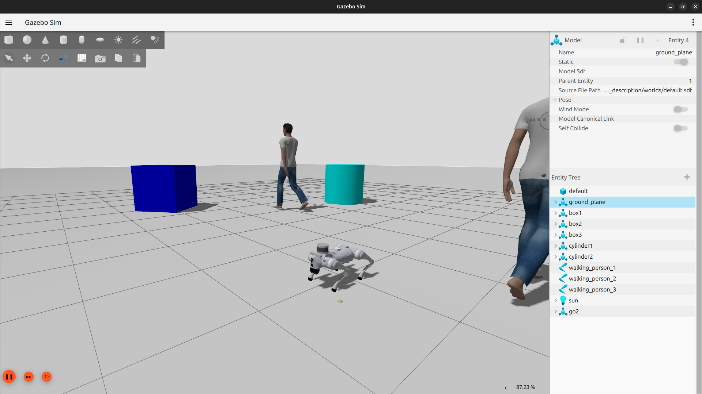
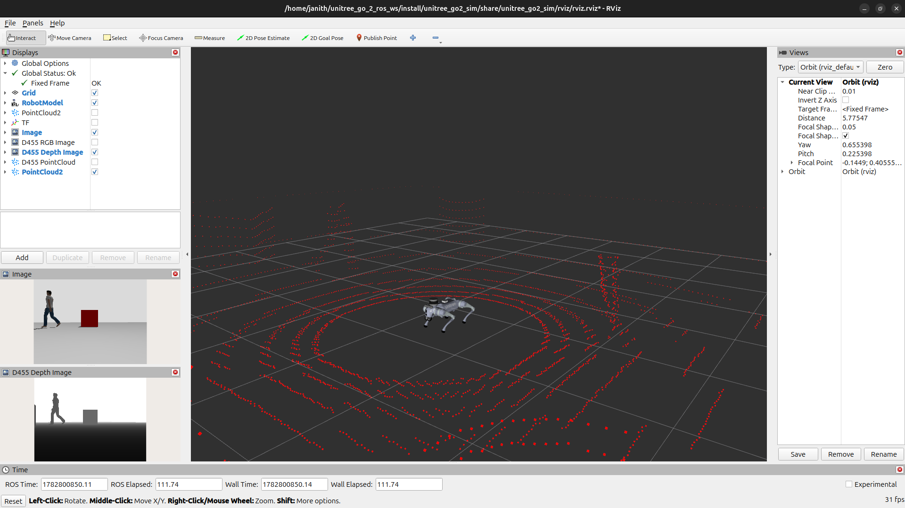

# Unitree Go2 Simulation (ROS 2)

The `unitree_go2_sim` package provides the core simulation environment and visualization configuration for the Unitree Go2 quadruped. It serves as the foundation for the `unitree_go2_slam` and navigation stack, managing the Gazebo Harmonic world, RViz configurations, and robot description loading.

## 📊 Simulation Environment

|           Gazebo Arena            |             Rviz Visualization              |
| :-------------------------------: | :-----------------------------------------: |
|  |  |

## 🚀 Key Components

- **Gazebo Harmonic Integration:** Houses the world files, sensor plugins, and physics parameters required for high-fidelity quadruped simulation.
- **RViz Visualization:** Contains pre-configured RViz display profiles (`.rviz`) designed for monitoring LiDAR data, TF transforms, and camera feeds.
- **Unified Launch Configuration:** Orchestrates the core simulation environment, including spawning the robot, loading controllers, and initializing the sensor-to-ROS bridges.

---

## 🛠️ Prerequisites

Ensure your workspace is configured for ROS 2 Jazzy and Gazebo Harmonic:

```bash
sudo apt update
sudo apt install ros-jazzy-ros-gz-sim \
                 ros-jazzy-ros-gz-bridge \
                 ros-jazzy-xacro

```

---

## 🏗️ Installation

1. Build the package:

```bash
cd ~/unitree_go_2_ros_ws/
colcon build --packages-select unitree_go2_sim
source install/setup.bash

```

---

## 🏃 Usage

### 1. Launching the Simulation

This package provides the base simulation. To launch the robot in the testing arena with standard visualization:

```bash
ros2 launch unitree_go2_sim unitree_go2_launch.py

```

### 2. RViz Visualization

Launch Gazebo with RVIZ:

```bash
ros2 launch unitree_go2_sim unitree_go2_launch.py rviz:=true

```

---

## 📂 Package Structure

```text
unitree_go2_sim/
├── config/                # Base simulation parameters
├── launch/
│   └── unitree_go2_launch.py  # Primary sim bringup
├── rviz/                  # Pre-configured visualization files
├── worlds/                # Gazebo environment files (.world)
├── package.xml
└── CMakeLists.txt

```
