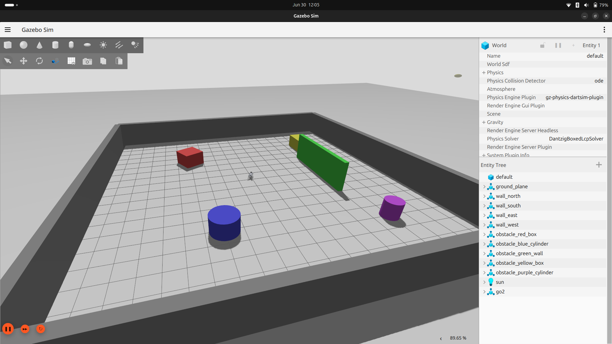
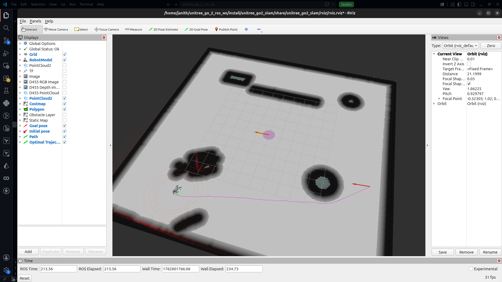

# Unitree Go2 SLAM & Navigation (ROS 2)

A complete ROS 2 (Jazzy) package for simulating, mapping, and autonomously navigating the Unitree Go2 quadruped robot in Gazebo. This package leverages `champ_base` for quadruped kinematics, `slam_toolbox` for 2D mapping, and the `nav2` stack for autonomous path planning and obstacle avoidance.

## 📊 Simulation Environment

|           Gazebo Arena            |      Rviz Visualization       |
| :-------------------------------: | :---------------------------: |
|  |  |

## 🚀 Features

- **Custom 20x20m Gazebo Arena:** A fully static obstacle course designed specifically for LiDAR SLAM testing.
- **Ground-Truth Odometry Bypass:** A custom TF tree architecture that bypasses simulated IMU failures by piping Gazebo ground-truth odometry directly into the `robot_localization` EKF.
- **2D LiDAR Conversion:** Real-time conversion of Velodyne VLP-16 3D PointClouds to 2D LaserScans for optimized mapping.
- **Full Autonomous Navigation:** Complete Nav2 integration including AMCL localization, global/local costmaps, and MPPI controller execution.

---

## 🛠️ Prerequisites & Dependencies

Ensure you have the following ROS 2 Jazzy packages installed:

```bash
sudo apt update
sudo apt install ros-jazzy-slam-toolbox \
                 ros-jazzy-navigation2 \
                 ros-jazzy-nav2-bringup \
                 ros-jazzy-pointcloud-to-laserscan \
                 ros-jazzy-robot-localization

```

_Note: This package assumes `unitree_go2_description`, `unitree_go2_sim`, and `champ` are already cloned and built in your workspace._

---

## 🏗️ Installation

Clone this repository into your ROS 2 workspace `src` directory and build:

```bash
cd ~/unitree_go_2_ros_ws/
colcon build --packages-select unitree_go2_slam
source install/setup.bash

```

---

## 🗺️ Phase 1: Mapping (SLAM Toolbox)

To generate a new map of the environment, use the SLAM launch file. This boots Gazebo, spawns the Go2, and initializes the asynchronous SLAM node.

### 1. Launch the SLAM Node

```bash
ros2 launch unitree_go2_slam slam.launch.py

```

### 2. Drive the Robot

In a separate terminal, launch the teleop node to drive the Go2 around the arena:

```bash
ros2 run teleop_twist_keyboard teleop_twist_keyboard

```

_Drive the robot until the perimeter and obstacles are clearly outlined in RViz._

### 3. Save the Map

Once the map is complete, save it to the package's `maps` directory. **Crucial:** You must use the `use_sim_time` flag to sync the map saver with Gazebo.

```bash
ros2 run nav2_map_server map_saver_cli -f src/unitree_go2_slam/maps/arena_map --ros-args -p use_sim_time:=true

```

---

## 🤖 Phase 2: Autonomous Navigation (Nav2)

Once you have an `arena_map.yaml` and `arena_map.pgm` saved, you can hand control over to the Navigation 2 stack.

### 1. Launch the Navigation Stack

```bash
ros2 launch unitree_go2_slam slam.launch.py

```

### 2. Set Initial Pose (AMCL Localization)

Nav2 boots up blind. You must tell AMCL where the robot is on the map:

1. In RViz, ensure **Fixed Frame** (Global Options) is set to `map`.
2. Click **2D Pose Estimate** in the top toolbar.
3. Click and drag on the map exactly where the robot is currently standing to set its position and orientation.
   _(The costmaps will instantly activate and terminal timeout warnings will cease)._

### 3. Send Goal Commands

1. Click **Nav2 Goal** (or 2D Goal Pose) in the RViz toolbar.
2. Click anywhere in the free space of the arena.
3. The global planner will generate a path, and the MPPI controller will autonomously walk the Go2 to the coordinates while dodging dynamic obstacles.

---

## 📂 Package Structure

```text
unitree_go2_slam/
├── config/
│   ├── gait/              # Quadruped gait parameters
│   ├── joints/            # Joint limits and hardware interface
│   └── ros_control/       # controller_manager configurations
├── launch/
    ├── slam.launch.py     # Mapping and hardware bringup
bringup
├── maps/
│   ├── arena_map.pgm      # 2D Occupancy grid image
│   └── arena_map.yaml     # Map metadata and scale
├── worlds/
│   └── room.world         # 20x20m Static obstacle testing arena
├── package.xml
└── setup.py

```
